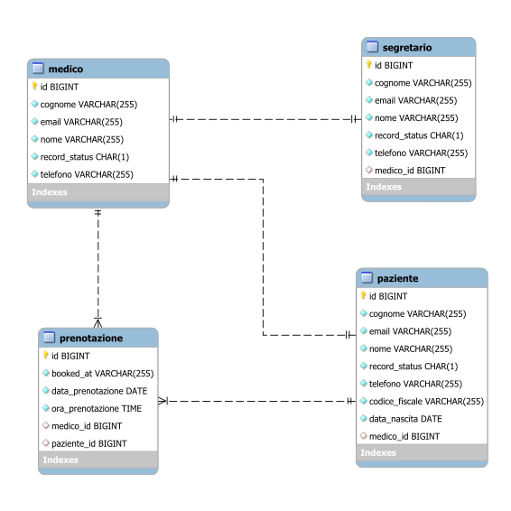

# Progetto Studio Medico (Medical Office)
### Team 1: Fabio Frattarelli, Dino Petrucci, Christian Carollo, Pietro Gallina

## Obiettivi

Il nostro sistema informatico è finalizzato alla gestione di un generico studio medico con lo scopo di:

 * Rendere più semplice e veloce la prenotazione delle visite per i pazienti. 
 * Migliorare e rendere più efficiente la gestione delle prenotazioni da parte del segretario/a. 
 * Facilitare la comunicazione tra paziente, segretario/a e medico. 

Nel software in progetto, si realizzerà l’architettura back-end di una piattaforma web di uno studio medico, 
nel dettaglio con la creazione di un database relazionale e di specifiche API REST che erogano  
e forniscono microservizi utilizzabili dal client nella controparte front-end.

## Attori coinvolti

* **MEDICO**: Visualizza e gestisce il proprio calendario delle prenotazioni dei relativi pazienti  
  (deve poter visualizzare, ed eliminare una prenotazione).   
* **SEGRETARIO/A:** Gestisce le prenotazioni dei pazienti del relativo medico associato  
  (Deve poter inserire, visualizzare, modificare ed eliminare una prenotazione).   
* **PAZIENTI:** Effettuano prenotazioni per visite mediche  
  (Deve poter inserire e visualizzare una prenotazione).

## Analisi del sistema

Le attuali modalità di prenotazione, mediante email e messaggistica, in assenza di una soluzione centralizzata, 
possono causare delle difficoltà nella gestione del calendario delle prenotazioni e nel coordinamento tra gli attori coinvolti.
Al fine di automatizzare e informatizzare il processo di prenotazione, la soluzione proposta consiste nel progettare 
e realizzare un sistema informatico dall’alto valore tecnologico per la gestione delle prenotazioni, secondo le specifiche tecniche di progettazione 
e gli standard tecnologici più recenti, a beneficio e garanzia di molteplici aspetti progettuali di notevole importanza, in termini di scalabilità,
manutenibilità e sicurezza, infine con particolare attenzione alle specifiche esigenze del cliente, con la possibilità di implementare 
inoltre nuove funzionalità e/o eventuali configurazioni personalizzate su richiesta del cliente, coinvolto nelle diverse fasi di progettazione 
realizzazione del sistema informatico, come da metodologia AGILE.

## Architettura del sistema

Il sistema informatico realizzato presenta un'architettura multi-tier (multi-strato)
modulare con moduli software (entities, repositories, services, controllers)
interdipendenti e agnostici distribuiti su più livelli (Data Access Layer, Business Layer,
Presentation Layer), per i quali ne realizzano rispettivamente la relativa logica
(persistenza ed accesso ai dati, business, presentazione)

L'architettura basata su microservizi prevede la creazione di un database relazionale nel 
quale i dati delle diverse entità del sistema verranno resi persistenti ed archiviati in 
modo organizzato e intelligente, e di specifiche API REST, interfacce di programmazione 
che erogano e forniscono dei microservizi, utilizzabili dai client (medico, segretario/a,
paziente) mediante delle apposite chiamate API, quali ad esempio le operazioni CRUD
dei pazienti, medici, segretari, piuttosto le prenotazioni, entità per le quali sono state
previste inoltre la cancellazione logica, il ripristino e le attività di auditing.

## Requisiti funzionali: 
### Tecnologie utilizzate nella progettazione e sviluppo dell’architettura back-end: 
 * **Java**, linguaggio di programmazione object-oriented (OOP); 
 * **Framework Spring** (Spring Boot, Spring Web, Spring Data, Spring Security, Maven); 
 * **Specifiche JPA, ORM Framework Hibernate** per l’automazione delle operazioni di persistenza dei dati; 
 * **Apache Tomcat**, web server open source, piattaforma software di esecuzione di applicazioni web 
 * **Database MySQL**, sistema RDBMS per la progettazione di database relazionali; 
 * **Swagger**, tool per la documentazione, test e collaudo delle API REST

## Modello logico

Il modello logico rappresenta un’ulteriore specializzazione del modello entità - relazione
(ERD), è un diagramma orientato ai dati che caratterizzano le entità e ai vincoli di relazione

Il modello logico relazionale che si ottiene è quindi il seguente:

* **medico**(id, nome, cognome, email, telefono)
* **segretario**(id, nome, cognome, email, telefono, medico_id*)
* **paziente**(id, nome, cognome, email, telefono, codice_fiscale, medico_id*)
* **prenotazione**(id, bookedAt, data_prenotazione, ora_prenotazione, stato_prenotazione, paziente_id*, medico_id*)

